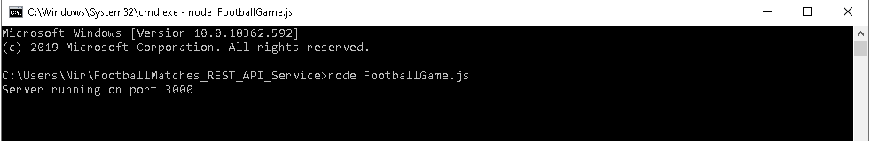
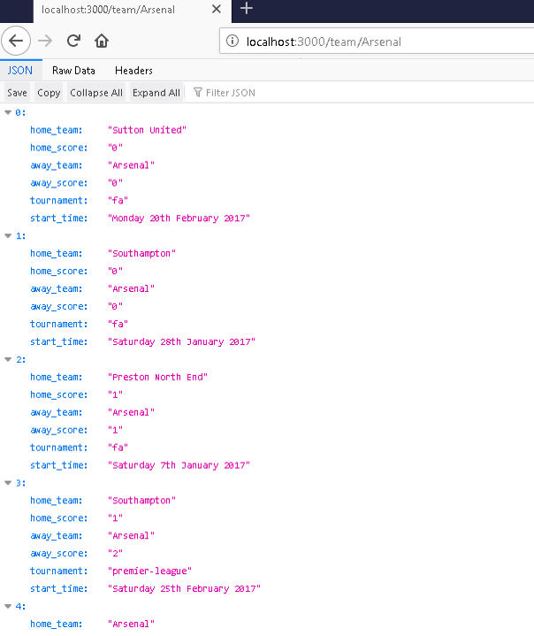
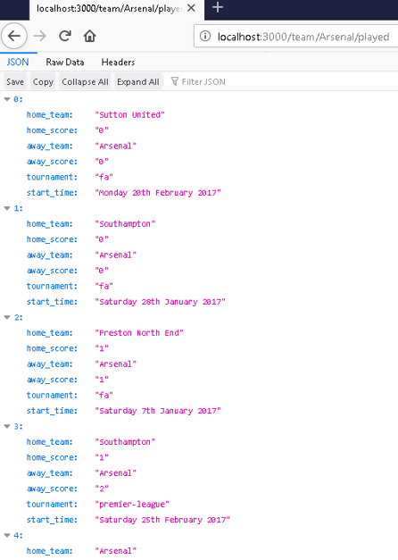
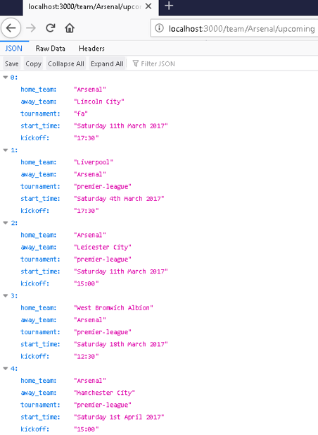
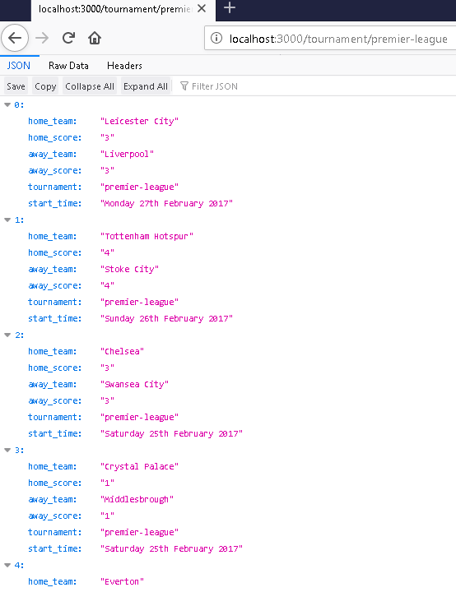
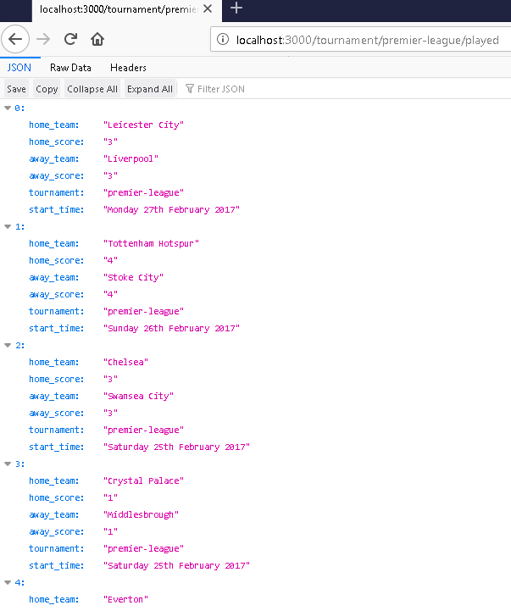
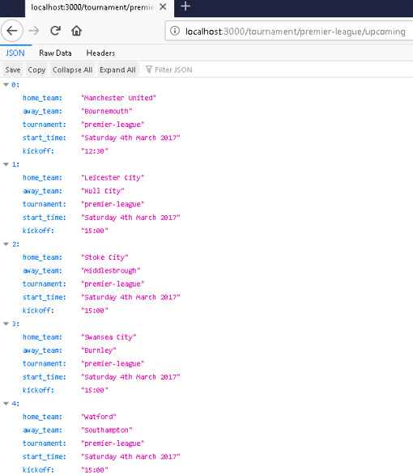

# Football Matches fixtures &amp; results - RESTful API Service (implemented in Node.js)

This project provides a football game service wich allows the customer clients can use to get the fixtures (upcoming
matches) and the results of football matches.

This restful api service is implemented in: http://localhost:3000/\
 
The system provides 4 different methods:
 
•	Get a list of matches by team
 
•	Get a list of matches by team & status (played/upcoming)
 
•	Get a list of matches by tournament
 
•	Get a list of matches by tournament filtered by status

For this project I used to following tools:
 
•	node.js
 
•	csvtojson
 
•	d3.js (for data filtering)

 
<h2>Instructions:</h2>
                                                                                                                               

    <h5>1. Extract "FootballMatches_REST_API_Service_Node.js" folder and open it.
    </h5>
    <h5>2. Open the command prompt from the folder path.
    </h5>
    <h5>3. In order to set on the RESTful API Service - Write the following command in the console:
    </h5>
     <h5>node FootballGame.js
    </h5>
     
    
                  

    <h5>4. Open your browser.
          </h5>
        <h5>5. Navigate to: http://localhost:3000/
          </h5>
    <h5>•   Get a list of matches by team:            
          </h5>
     
    

    <h5>•   Get a list of matches by team & status (played/upcoming):             
          </h5>
     
    
    

    <h5>•   Get a list of matches by tournament:             
          </h5>
     
    

    <h5>•   Get a list of matches by tournament filtered by status:             
          </h5>
     
    
    

